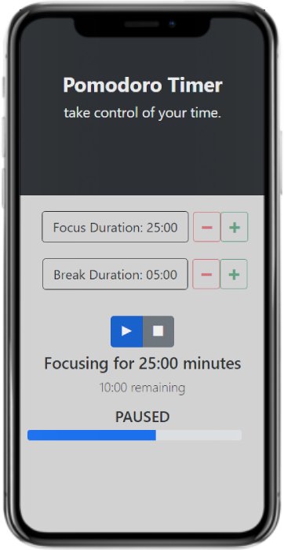
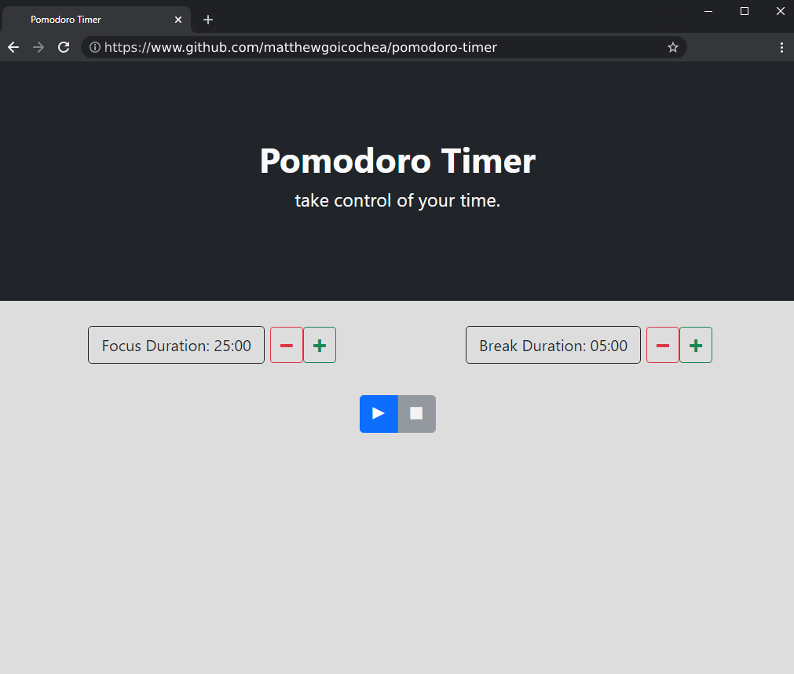

# Pomodoro Timer

Pomodoro Timer is an app for users wishing to take control of their time while studying effectively. Based on the [Pomodoro Technique](https://en.wikipedia.org/wiki/Pomodoro_Technique#:~:text=The%20Pomodoro%20Technique%20is%20a,length%2C%20separated%20by%20short%20breaks.), it focuses on keeping track of your study time and break time, reminding you to switch gears at each interval.

## Screenshots

## Links

- [Live Demo](https://pomodoro-timer-htoxfrxxc-matthewgoicochea.vercel.app/)

## Technology

### Built with:

- React
  - Created with [create-react-app](https://github.com/facebook/create-react-app)
  - Implemented [React Hooks](https://reactjs.org/docs/hooks-intro.html)
